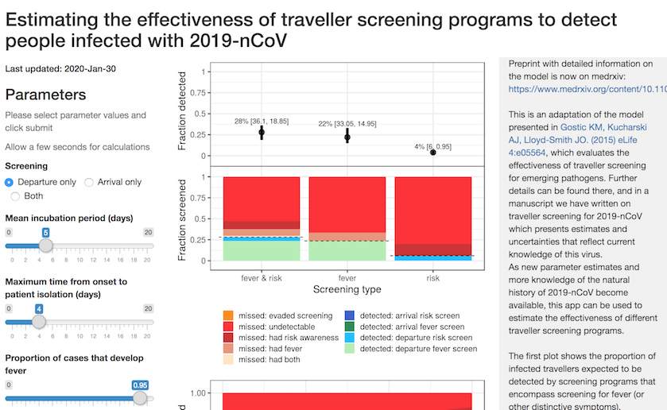

# TravelScreenShiny

Code for the shiny app of the 2019-nCoV traveler screening model. Can be used to generate an interactive web application that estimates the percentage of travelers that would be detected by a traveler screening intervention, either by assessing symptoms or with a risk assessment questionnaire. 

A current version of the app is hosted at https://faculty.eeb.ucla.edu/lloydsmith/screeningmodel

More information on the underlying model and figures presented can be found at https://www.medrxiv.org/content/10.1101/2020.01.28.20019224v1

## How to run

We recommend using Rstudio. Requires CRAN packages shiny, tidyverse, gridExtra, and viridis.

## What it looks like

## Authors

Ana Gomez (acrgomez) and Katelyn Gostic (kgostic)

